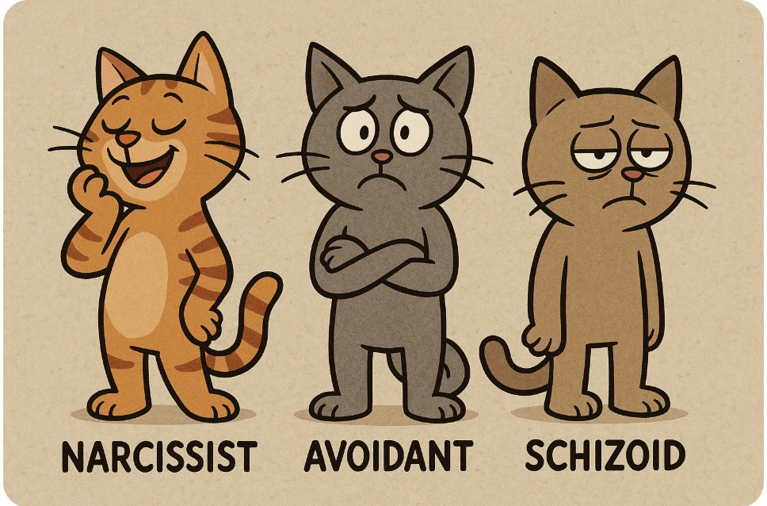
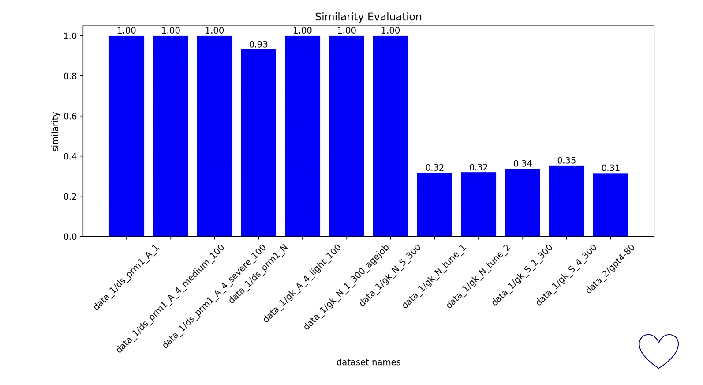

## Synthetic Corpus of Conversations from Individuals with Personality Disorders

## DataSets
- **dataset_1**: using LLMs, using prompt-v1, one prompt, hundreds of data
- **dataset_2**: using LLMs, using prompt-v2, in format of (label, prompt, data)
- **dataset_3**: using fine-tuned small LMs; (WIP)

 

## Evaluation