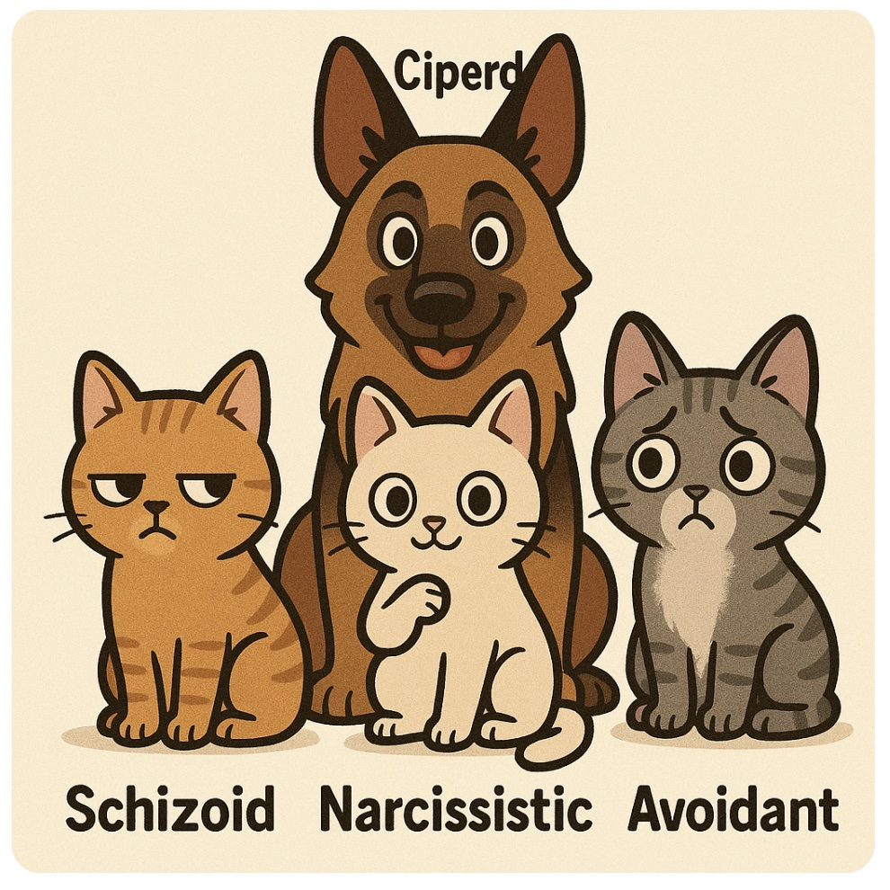
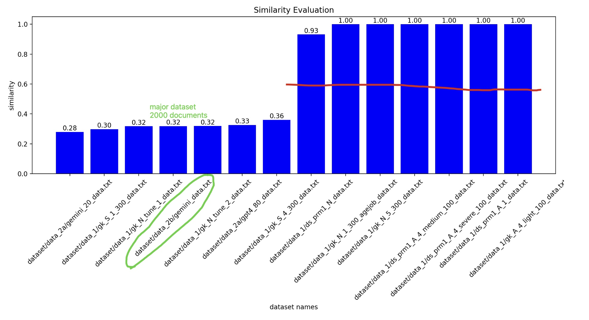

## Ciperd: Conversations (C) from Individuals(I) with Personality(Per) Disorders(D)

A SYNTHETIC DATASET: Ciperd

Pronounced as “kæhprd”

## DataSets
For Fine-tuning BertForSequenceClassification with 110M parameters, we probably requires > 1M tokens;
Progress: ▓▓▓▓▓▓▓▓▓ 100% (1 Million Tokens)

| Name       | Explanation                                         | Number of Tokens | Size  | Number of Documents |
| ---------- | --------------------------------------------------- | ---------------- | ----- | ------------------- |
| dataset_1  | Using LLMs, prompt-v1, one prompt, hundreds of data | 170,626          | 532KB | 1800                |
| dataset_2a | LLMs, prompt-v2, format (label, prompt, data)       | 31,827           | 132KB | 100                 |
| dataset_2b | Gemini-API, prompt-v2, format (label, prompt, data) | 885,730          | 3.3MB | 100                 |
| dataset_3  | Using fine-tuned small LMs; (WIP)                   | \-               | \-    | \-                  |

 

### One Sample Piece of Conversation

a conversation between A and B where A has labels of [0, 1, 1] which means A is both Narcissist and Avoidant

> A: Oh, travel. It's something I approach with a certain… distinction, unlike most, I find. B: Do you travel often? A: When the destination aligns with my particular sensibilities, yes. I don't simply go anywhere, you understand. It must offer something… exceptional. B: What makes a destination exceptional for you? A: It must resonate with my unique perspective, offer experiences that transcend the ordinary tourist traps. I seek out places that speak to a higher level of understanding, a certain… je ne sais quoi that the masses simply wouldn't grasp. B: So you prefer more off-the-beaten-path locations? A: Not necessarily 'off-the-beaten-path' in the common sense. More… curated. Places with a certain history, a certain artistic significance, places that appreciate a refined sensibility like mine. B: I see. So, more culturally rich destinations? A: Precisely. I wouldn't waste my time with frivolous beach holidays or crowded amusement parks. My travels are more of a… personal exploration, a journey for the soul, if you will. B: Have you been anywhere particularly memorable lately? A: Recently, I visited a small, privately owned gallery in Florence. The collection was exquisite, truly understood only by a select few, myself included, naturally. The owner recognized my… discerning eye immediately. B: That sounds like a unique experience. A: It was. Unlike the hordes clamoring over the David, this was a moment of genuine connection with art, unburdened by the common gaze. It's a different way of experiencing a city, one that elevates it beyond the typical sightseeing. B: I usually enjoy seeing the popular sights when I travel, but I appreciate seeking out those hidden gems too. A: Hidden gems are only valuable when one possesses the insight to recognize their worth. For most, they remain simply… hidden. My ability to unearth and appreciate them is, I believe, rather special. B: So, the exclusivity of an experience adds to its appeal for you? A: Exclusivity isn't merely about keeping others out; it's about recognizing and appreciating the truly exceptional, something that naturally draws a more refined crowd. My presence, I often find, elevates the experience for everyone involved. B: That's an interesting way to look at it. A: It's the accurate way. Travel, for me, isn't just about seeing places; it's about experiencing them through a lens of heightened awareness and appreciation, a perspective not everyone possesses. It's a gift, really. B: Well, it sounds like you have a very specific way of approaching travel. A: Indeed. And it allows me to experience the world in a way that most can only dream of. It's one of the many things that sets me apart.

<!--  -->

## Evaluation

### 1) Evaluation of Diversity

### 2) Evaluation of Faithfulness

### 3) Evaluation of Impacts

## Todos

### clear part
- [x] (dataset) keep accumulating gemini data, run diversity check
- [ ] (dataset) sft t5 as a small model for this using gemini seed data

### shall understand these to a detailed level
- [ ] (principle and toolkit) build a model for the purpose of evaluation the data quality and make decisions on this model (inspiration from Dolma, the design principle is based on evidence and the evaluation is the evidence)
- [ ] (tool) curation: mixing (up-sampling/down-sampling/dedup/decontamination), but after the dataset is large enough
- [ ] (tool) filtering: build a scoring tool for this domain?
- [ ] (data ablation) a small model of 1B can do that 

